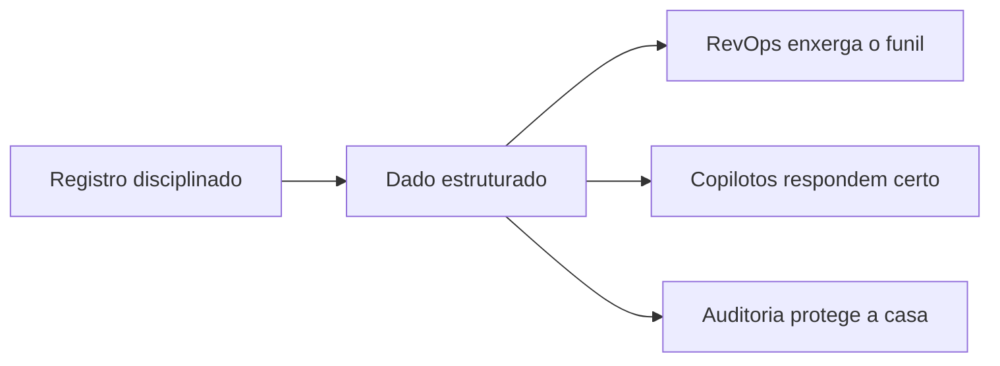

<Info>
  **Ao terminar esta página, você consegue:** registrar uma oportunidade e suas interações no padrão certo — o que faz a máquina e os copilotos funcionarem.
</Info>

## O que é isso

Registro não é burocracia — é o que transforma conversa em dado, e dado em inteligência. Uma oportunidade não registrada não existe para a empresa: não entra em RevOps, não alimenta copiloto, não protege a casa em auditoria.

## O que registrar

## Como fazer

<Steps>
</Steps>

## Por que isso importa

## Regras da casa aqui

<Warning>
  Dado de investidor e de parceiro é sensível — registrar não é expor. Seguir as regras de acesso e privacidade. Nunca registrar promessa que não foi feita nem inflar estágio. Ver [Recordkeeping](/regras/recordkeeping).
</Warning>

## Para onde ir agora

<CardGroup cols={2}>
  <Card title="Como a Máquina Gira" icon="gears" href="/maquina/revops">
  </Card>

  <Card title="Nossas Ferramentas" icon="toolbox" href="/ferramentas/plataforma">
  </Card>

  <Card title="Recordkeeping" icon="box-archive" href="/regras/recordkeeping">
  </Card>
</CardGroup>