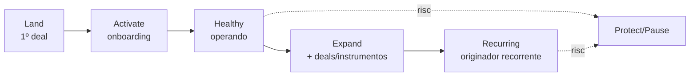

<Info>
  **Ao terminar esta página, você consegue:** dizer em que estágio uma conta está e qual é o trabalho certo para movê-la ao próximo — ou protegê-la.
</Info>

## O que é isso

A conta tem estágios de vida, como o deal tem estágios de execução. Saber o estágio define o objetivo: ativar não é expandir, expandir não é reter. Confundir os dois desperdiça esforço.

## Os estágios

| Estágio | Objetivo | Sinal de avanço | Risco principal |
| --- | --- | --- | --- |
| Land | Fechar o 1º deal | Deal liquidado | CAC alto sem 2º deal |
| Activate | Onboarding completo | Parceiro operando sozinho | Onboarding arrastado |
| Healthy | Manter a relação viva | Health Score verde | Silêncio, uso caindo |
| Expand | \+ deals, \+ instrumentos | 2ª operação originada | Estagnar no 1º deal |
| Recurring | Originador recorrente | Fluxo previsível | Dependência de 1 champion |

## Como fazer

<Steps>
</Steps>

## Como gera receita ou reduz risco

Cada avanço de estágio aumenta deals-por-conta e instrumentos-por-conta — a métrica que faz a margem aparecer. Estagnação e churn são a perda a evitar.

## Para onde ir agora

<CardGroup cols={2}>
  <Card title="Onboarding de Parceiro" icon="door-open" href="/contas/onboarding">
  </Card>

  <Card title="Health Score" icon="heart-pulse" href="/contas/health-score">
  </Card>

  <Card title="Plano de Expansão" icon="arrow-trend-up" href="/contas/plano-de-expansao">
  </Card>
</CardGroup>