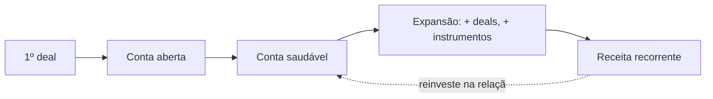

<Info>
  **Ao terminar esta página, você consegue:** explicar por que cuidamos da conta e não do deal, e como uma relação B2B vira ativo econômico recorrente.
</Info>

## O que é isso

Este domínio não é customer success. É **gestão de ativo**: a conta B2B é a unidade que a Bloxs administra para gerar receita recorrente e reduzir risco. O deal é um evento; a conta é o ativo.

> Deal passa. Conta fica.

## Por que a conta, não o deal

Um deal grande que passa uma vez vale menos que um parceiro que faz vários deals por ano e não sai. A economia da Bloxs vive na recorrência — ver [Como Ganhamos Dinheiro](/quem-somos/como-ganhamos-dinheiro).

## O que este domínio governa

<CardGroup cols={2}>
  <Card title="Entrada e onboarding" icon="door-open" href="/contas/onboarding">
    Como a conta entra e é ativada.
  </Card>

  <Card title="Saúde" icon="heart-pulse" href="/contas/health-score">
    Como sabemos se a conta está bem — antes de ela adoecer.
  </Card>

  <Card title="Expansão" icon="arrow-trend-up" href="/contas/plano-de-expansao">
    Como transformar parceiro em originador recorrente.
  </Card>

  <Card title="Governança e risco" icon="shield-halved" href="/contas/red-flags-encerramento">
    Quando proteger, pausar ou encerrar uma conta.
  </Card>
</CardGroup>

## Como a conta alimenta o resto da casa

## Os três tipos de conta — sem confundir papéis

<Warning>
  **Sell Side** é cliente do IBaaS (origina). **Enterprise** é cliente de plataforma (opera sob marca própria). **Buy Side** NÃO é cliente do IBaaS — é o consumidor do ecossistema e fonte de demanda. Cada um tem uma página própria; nunca tratar Buy Side como cliente nem Enterprise como Buy Side.
</Warning>

## Para onde ir agora

<CardGroup cols={2}>
  <Card title="Lifecycle da Conta" color="#033873" icon="arrows-spin" href="/contas/account-lifecycle">
    Os estágios que uma conta atravessa — do land ao encerramento.
  </Card>

  <Card title="Contas Sell Side" color="#2E61FF" icon="arrow-up-right-dots" href="/contas/contas-sell-side">
    Como tratamos os originadores que rodam mercado de capitais sobre o trilho da Bloxs.
  </Card>

  <Card title="Como Ganhamos Dinheiro" color="#033873" icon="coins" href="/quem-somos/como-ganhamos-dinheiro">
    Por que a economia da casa vive na recorrência da conta, não no evento do deal.
  </Card>
</CardGroup>