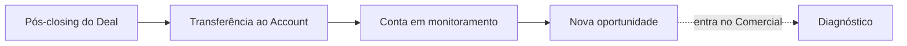

<Info>
  **Ao terminar esta página, você consegue:** pegar uma operação que acabou de liquidar e transformá-la no ponto de partida de uma conta que se expande.
</Info>

## O que é isso

É a costura entre os dois domínios: o [Pós-closing do Deal](/deal/pos-closing) entrega a operação viva; o Account assume a relação. É aqui que "deal passa" encontra "conta fica" — o ponto exato onde o flywheel fecha e recomeça.

## O fluxo

## Como fazer

<Steps>
</Steps>

## O que precisa vir do pós-closing

## Como gera receita

Este handoff é o que impede o parceiro de fazer o segundo deal em outro lugar. Um pós-closing que vira conta gerida transforma um evento único em receita recorrente.

## Para onde ir agora

<CardGroup cols={2}>
  <Card title="Lifecycle da Conta" icon="arrows-spin" href="/contas/account-lifecycle">
  </Card>

  <Card title="Plano de Expansão" icon="arrow-trend-up" href="/contas/plano-de-expansao">
  </Card>

  <Card title="Pós-closing (de onde vem)" icon="chart-line" href="/deal/pos-closing">
  </Card>
</CardGroup>