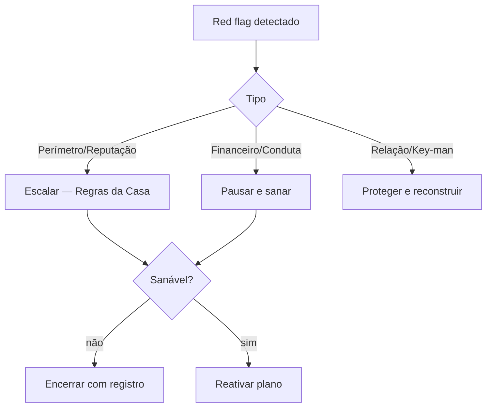

<Info>
  **Ao terminar esta página, você consegue:** reconhecer quando uma conta virou risco e decidir entre proteger, pausar ou encerrar — escalando quando o sinal é de perímetro.
</Info>

## O que é isso

Nem toda conta deve ser mantida. Este é o lado de **governança** do domínio: os sinais que tiram uma conta do modo "cuidar" e a colocam em "proteger, pausar ou encerrar". Uma conta que vira risco reputacional custa mais que a receita que traz.

<Warning>
  Página em revisão de compliance — ainda não é fonte autorizada para copilotos. A direção está correta; os critérios de encerramento passam por validação jurídica.
</Warning>

## Os red flags

## A decisão

## Como fazer

<Steps>
</Steps>

## Como reduz risco

Encerrar uma conta tóxica é redução de risco, não perda de receita. Uma conta que cruza o perímetro é passivo. Proteger a casa vale mais que qualquer fee.

## Regras da casa aqui

<Warning>
  Red flag de perímetro ou reputação é [Regras da Casa](/regras/guardrails) — escalar, não negociar. Reputação acima do deal, e acima da conta. Ver [Reputação acima do Deal](/quem-somos/reputacao-acima-do-deal).
</Warning>

## Para onde ir agora

<CardGroup cols={2}>
  <Card title="Playbook de Reativação" icon="rotate-right" href="/contas/playbook-reativacao">
  </Card>

  <Card title="Regras da Casa" icon="scale-balanced" href="/regras/guardrails">
  </Card>

  <Card title="Health Score" icon="heart-pulse" href="/contas/health-score">
  </Card>
</CardGroup>