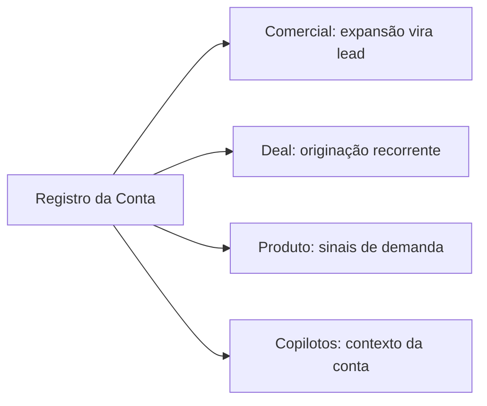

<Info>
  **Ao terminar esta página, você consegue:** registrar uma conta e seu histórico no padrão que faz Comercial, Deal, Produto e os copilotos funcionarem com dado real.
</Info>

## O que é isso

Registro é o que transforma a relação em ativo mensurável. Uma conta que só existe na cabeça do gestor não é da empresa — é dele. O registro protege a casa contra key-man e alimenta toda a máquina com dado estruturado.

## O que registrar

## Como isso alimenta a casa

## Como fazer

<Steps>
</Steps>

## Como reduz risco

Registro disciplinado é a defesa contra o risco key-man do lado da Bloxs: a conta pertence à empresa, não a uma pessoa. E é o que dá memória aos copilotos.

## Regras da casa aqui

<Warning>
  Dado de conta, parceiro e investidor é sensível — registrar não é expor. Seguir as regras de acesso e privacidade. Ver [Recordkeeping](/regras/recordkeeping).
</Warning>

## Para onde ir agora

<CardGroup cols={2}>
  <Card title="Como a Máquina Gira" icon="gears" href="/maquina/revops">
  </Card>

  <Card title="KPIs de Account" icon="chart-simple" href="/contas/kpis-account">
  </Card>

  <Card title="Recordkeeping" icon="box-archive" href="/regras/recordkeeping">
  </Card>
</CardGroup>