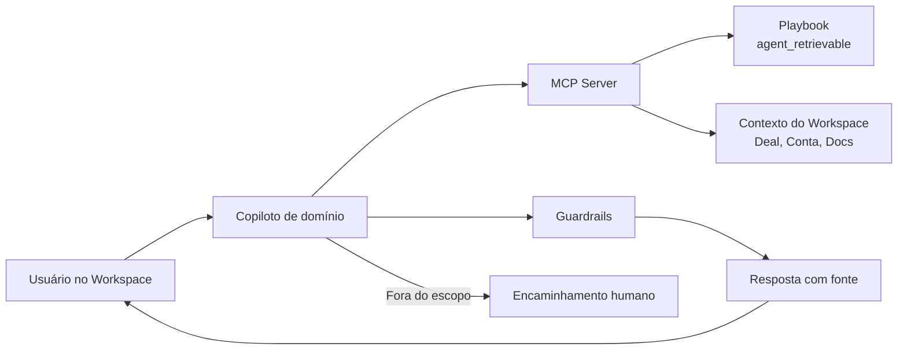

<Info>
  **Ao terminar esta página, você consegue:** descrever o que é um copiloto na Bloxs, listar os copilotos ativos e seus escopos, reconhecer os guardrails que se aplicam e identificar quando uma resposta de copiloto deve ser tratada como referência e não como decisão final.
</Info>

## Em uma frase

Os copilotos Bloxs são assistentes de IA embarcados no Playbook e no Workspace, **cada um com escopo declarado**, contrato de metadados e guardrails — nunca chatbots genéricos, nunca fontes de decisão regulada.

## Por que isso existe na Bloxs

A operação de mercado de capitais é regida por regras densas, terminologia específica e trilha auditável. Um assistente sem escopo produz três problemas: (i) resposta fora de contexto, (ii) invenção de fato ("alucinação") em cima de regra sensível, (iii) impossibilidade de auditar quem disse o quê.

A Bloxs recusa esses três problemas. Cada copiloto tem **domínio próprio**, **fontes controladas** e **guardrails explícitos**. Uma resposta é sempre rastreável até o conteúdo `agent_retrievable` que a fundamentou.

## Como a Bloxs enxerga

Um copiloto é uma **capacidade institucional**, não um brinquedo. Ele opera sob três princípios:

1. **Escopo declarado** — cada copiloto responde a um domínio (Capital Markets, Partner Success, Compliance, RevOps). Fora do escopo, ele **encaminha**, não improvisa.
2. **Fonte controlada** — só responde a partir de conteúdo classificado como `agent_retrievable: true`. Conteúdo em revisão, confidencial ou sensível fica fora.
3. **Guardrails de recuperação** — regras explícitas do que pode retornar, com que grau de certeza, e o que exige encaminhamento humano.

## Como funciona na prática

Cada pergunta atravessa: identificação do copiloto → recuperação de contexto via MCP → aplicação dos guardrails → resposta com fonte citada ou encaminhamento.

## Os copilotos ativos

| Copiloto | Domínio | Quem usa | O que responde | O que NÃO responde | Status |
| --- | --- | --- | --- | --- | --- |
| **capital-markets-advisor** | Estruturas, Selection Matrix, Fundability | Comercial, Estruturação, parceiro | "Este deal cabe em CR ou FIDC?" (com critérios) | Aprovação definitiva de estrutura | Beta interno |
| **partner-success** | Contas, ciclo, expansão, retenção | Account, Comercial | "Qual o próximo passo desta conta?" | Comprometer aditivo/desconto sem alçada | Beta interno |
| **compliance** | Perímetro, promessas, materiais, escalonamento | Todos | "Essa frase pode ser dita?" / "Isso é distribuição?" | Parecer jurídico definitivo | Beta interno |
| **product** | Workspace, capacidades, integrações | Produto, Suporte, Enterprise | "Que capacidade resolve X?" | Roadmap comprometido com data | Beta interno |
| **deal-structuring** | Jornada de deal, etapas, comitês | Estruturação, Coordenação | "Onde este deal está e o que falta?" | Decisão de comitê sem quórum | Beta interno |

<Warning>
  Todos os copilotos estão em **beta interno**. Nenhuma resposta substitui aprovação humana onde ela é obrigatória (Compliance, Estruturação, Coordenação, Alçadas).
</Warning>

## Objetos e permissões

Os copilotos leem contexto do Workspace via [MCP Server](/devs/overview) — sempre respeitando as permissões do usuário que perguntou. Um usuário sem acesso a um `Deal` não recebe resposta que revele dados desse deal.

| Objeto acessível | Uso pelo copiloto | Limite |
| --- | --- | --- |
| `Account` | Ler saúde, histórico, próximos passos | Somente contas do usuário |
| `Deal` | Ler estágio, comitês, documentos | Somente deals do usuário |
| `Document` | Referenciar por metadados | Não lê conteúdo confidencial |
| `Investor` | Consultar apetite institucional | Restrito à Coordenação |
| Playbook | Recuperar conteúdo `agent_retrievable` | Ignora páginas em revisão / confidenciais |

## Critérios de decisão — quando confiar, quando escalar

- **Confia** quando o copiloto cita fonte do Playbook, o domínio corresponde ao seu papel e a resposta é rastreável.
- **Confirma** quando a resposta toca perímetro, oferta, promessa, alçada ou material — sempre com humano responsável.
- **Escala** quando o copiloto responde "não sei", "fora do escopo" ou quando a resposta contradiz uma regra da casa.
- **Recusa** o uso quando alguém pede ao copiloto para "prometer", "recomendar investimento" ou "aprovar" — nenhum copiloto tem essa autorização.

## Papéis e responsabilidades

| Domínio | Dono editorial | Aprova regras | Responde por incidente |
| --- | --- | --- | --- |
| capital-markets-advisor | Estruturação | Estruturação \+ Compliance | Estruturação |
| partner-success | Account Leadership | Account \+ Compliance | Account Leadership |
| compliance | Compliance | Compliance | Compliance |
| product | Produto | Produto | Produto |
| deal-structuring | Estruturação | Estruturação \+ Compliance | Estruturação |

## Riscos e red flags

<Warning>
  **Sinais de mau uso do copiloto:**

  - Usar resposta de copiloto como aprovação regulatória.
  - Colar resposta de copiloto em material que vai ao mercado sem revisão.
  - Perguntar ao copiloto algo fora do seu domínio e assumir a resposta como verdade.
  - Usar copiloto para "gerar" promessa que a regra proíbe.
  - Compartilhar output do copiloto com Buy Side sem passar por Compliance.
</Warning>

## Linguagem segura

✅ "O copiloto sugere CR ou FIDC — vou confirmar com Estruturação." ✅ "O copiloto encaminhou para Compliance — vou aguardar." ❌ "O copiloto disse que pode, então pode." ❌ "O copiloto aprovou a estrutura." ❌ "Vou mandar essa resposta do copiloto pro investidor."

## Registro obrigatório

Toda interação com copiloto em contexto operacional deixa log:

- Pergunta (transcrita).
- Copiloto acionado e escopo aplicado.
- Fontes recuperadas.
- Resposta gerada.
- Ação humana subsequente (aceite, revisão, escalação).

O log protege o colaborador, o parceiro e a Bloxs. Sem trilha, a resposta do copiloto não existe.

## Continue por aqui

<CardGroup cols={2}>
  <Card title="Contrato de Metadados" href="/copilotos/contrato-de-metadados">
    Como o Playbook expõe metadados que sustentam os copilotos.
  </Card>

  <Card title="Guardrails de Recuperação" href="/copilotos/guardrails-de-recuperacao">
    O que o copiloto pode e não pode retornar, e por quê.
  </Card>

  <Card title="Uso de IA" href="/regras/uso-de-ia">
    As regras de conduta que se aplicam a qualquer uso de IA na Bloxs.
  </Card>

  <Card title="Developers — Visão Geral" href="/devs/overview">
    A camada técnica (MCP, API, Eventos) que sustenta os copilotos.
  </Card>
</CardGroup>