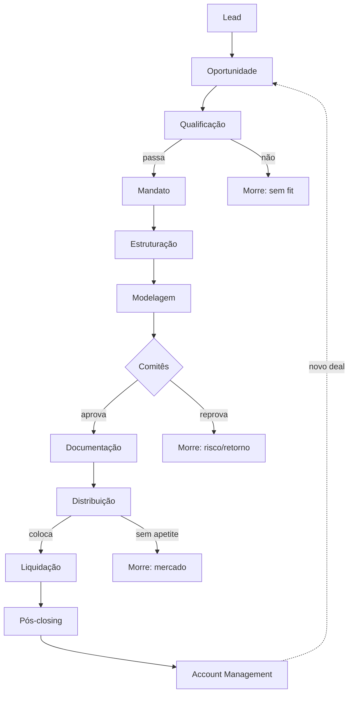

<Info>
  **Ao terminar esta página, você consegue:** olhar qualquer deal e dizer em que estágio ele está, quem é o dono, qual decisão precisa ser tomada, e se ele avança ou morre.
</Info>

## O que é isso

Este é o **Investment Banking Playbook** da Bloxs. Não é um workflow — é o mapa de **como uma operação de mercado de capitais nasce, evolui e gera receita**. Cada estágio existe porque uma **decisão** precisa ser tomada ali. Documentamos decisões, não atividades.

O deal não "anda" sozinho. Em cada estágio há um dono, um critério e um gate: ou o deal **avança** (com um output obrigatório para o próximo estágio) ou **morre** (com registro).

## A jornada inteira

O loop final é o ponto: o pós-closing bem-feito devolve o parceiro ao topo como **nova oportunidade**. É assim que um deal vira uma conta, e uma conta vira receita recorrente.

## Onde vive cada estágio no Playbook

Três estágios são **porta de entrada** (vivem em Como Vendemos) e um é **porta de saída** (vive em Como Cuidamos das Contas). O domínio Deal cobre do Mandato ao Pós-closing em detalhe.

| # | Estágio | Onde está documentado | Dono |
| --- | --- | --- | --- |
| 1 | Lead | [Como Vendemos › ICP](/como-vendemos/icp-e-segmentacao) | Comercial |
| 2 | Oportunidade | [Como Vendemos › Diagnóstico](/como-vendemos/diagnostico) | Comercial |
| 3 | Qualificação | [Como Vendemos › Qualificação](/como-vendemos/qualificacao) | Comercial |
| 4 | Mandato | [Deal › Intake & Mandato](/deal/intake) | Deal Lead |
| 5 | Estruturação | [Deal › Estruturação](/deal/estruturacao) | Estruturação |
| 6 | Modelagem | [Deal › Modelagem](/deal/modelagem) | Estruturação |
| 7 | Comitês | [Deal › Comitês](/deal/comites) | Comitê |
| 8 | Documentação | [Deal › Documentação](/deal/documentacao) | Jurídico |
| 9 | Distribuição | [Deal › Distribuição](/deal/coordenacao-colocacao) | Mesa |
| 10 | Liquidação | [Deal › Liquidação](/deal/liquidacao) | Operações |
| 11 | Pós-closing | [Deal › Pós-closing](/deal/pos-closing) | Deal \+ Ops |
| 12 | Account Mgmt | [Como Cuidamos das Contas](/contas/account-lifecycle) | Account |

## Como ler qualquer deal

<Steps>
</Steps>

## Como o deal gera receita

Cada estágio adiciona valor — e a receita entra conforme a contribuição. Set up na estruturação, success fee na colocação, coordenação na distribuição, gestão no pós. Ver [Como Ganhamos Dinheiro](/quem-somos/como-ganhamos-dinheiro).

## Regras da casa aqui

<Warning>
  Nenhum deal pula um gate. Um "sim" em risco jurídico ou reputacional em qualquer estágio para o deal e escala — por melhor que seja o número. Reputação acima do deal. Ver [Regras da Casa](/regras/guardrails).
</Warning>

## Para onde ir agora

<CardGroup cols={2}>
  <Card title="Intake & Mandato" color="#033873" icon="file-import" href="/deal/intake">
    A porta de entrada oficial do deal — quando ele deixa de ser conversa e vira operação.
  </Card>

  <Card title="Estruturação" color="#2E61FF" icon="compass-drafting" href="/deal/estruturacao">
    Onde o deal ganha forma: instrumento, veículo, garantias, waterfall.
  </Card>

  <Card title="Comitês" color="#033873" icon="gavel" href="/deal/comites">
    O gate de risco e retorno — quem aprova, quem reprova, com base em quê.
  </Card>

  <Card title="Como Ganhamos Dinheiro" color="#2E61FF" icon="coins" href="/quem-somos/como-ganhamos-dinheiro">
    Como cada estágio do deal se converte em receita para a casa.
  </Card>
</CardGroup>