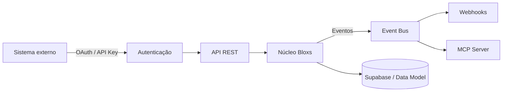

<Info>
  **Ao terminar esta página, você consegue:** entender o papel da camada técnica na Plataforma IBaaS, saber quais capacidades estão disponíveis hoje, quais são internas, beta ou roadmap, e por onde começar uma integração.
</Info>

## Em uma frase

O Developer Platform da Bloxs é a camada técnica que expõe a operação de mercado de capitais como serviço — APIs, eventos, webhooks, MCP e integrações — sob os mesmos guardrails regulatórios da plataforma.

## Papel na arquitetura Bloxs

A Plataforma IBaaS tem três camadas:

1. **Workspace** — a interface pela qual o parceiro opera.
2. **Trilho regulado** — as entidades licenciadas Bloxs que executam a atividade privativa.
3. **Developer Platform** — a camada programática que expõe o Workspace e o trilho para integração com sistemas externos.

A Developer Platform não é um produto separado. É a mesma operação do Workspace vista por outra interface — sujeita aos mesmos [guardrails de perímetro](/regras/perimetro-regulatorio).

<Warning>
  Esta área está em construção. Cada capacidade abaixo tem um `status` explícito (disponível, interno, beta, roadmap). Não assuma disponível sem checar.
</Warning>

## Quem usa

| Perfil | Uso típico | Acesso |
| --- | --- | --- |
| **Time Bloxs (interno)** | Automações internas, integrações entre HubSpot / Workspace / Supabase / Looker | Credencial interna |
| **Enterprise (white-label)** | Integração do trilho Bloxs à stack própria do cliente | Credencial contratada |
| **Parceiro Sell Side** | Automações leves sobre pipeline e deals próprios | Depende do contrato |
| **Dev externo** | Somente integrações homologadas | Homologação formal |

## Como funciona

O fluxo técnico segue o modelo clássico de plataforma B2B regulada:

## Objetos principais

O modelo de dados expõe as entidades operacionais da Bloxs. Nomes são normativos; o schema completo vive em [Data Model](/maquina/data-model).

| Objeto | Descrição | Uso típico | Status |
| --- | --- | --- | --- |
| `Account` | Conta B2B — unidade econômica da Bloxs. | Ler saúde, expandir, registrar. | Disponível (interno) |
| `Partner` | Parceiro Sell Side ou Enterprise vinculado à conta. | Gestão de relacionamento e permissões. | Disponível (interno) |
| `Deal` | Operação de mercado de capitais em qualquer estágio. | Rastrear jornada, comitês, docs. | Disponível (interno) |
| `Investor` | Contraparte compradora institucional (Buy Side). | Registrar apetite e alocações. | Beta |
| `Document` | Documento de operação, lastro ou governança. | Data Room, versionamento. | Disponível (interno) |
| `Event` | Evento operacional emitido pelo núcleo. | Automações, audit trail. | Disponível (interno) |
| `User` | Usuário de um Workspace. | Autenticação, sessão. | Disponível (interno) |
| `Permission` | Regra de acesso aplicada a `User` sobre `Account` / `Deal`. | Controle de perímetro. | Disponível (interno) |

## Autenticação

- **Uso interno:** credenciais gerenciadas por Tecnologia.
- **Enterprise:** OAuth 2.0 client credentials, escopo por contrato.
- **Dev externo homologado:** API key \+ IP allowlist.

Toda credencial é pessoal ou institucional, nunca compartilhada. Log de uso obrigatório.

## Webhooks e eventos

O Event Bus emite eventos assíncronos que refletem mudanças de estado no núcleo. Cada consumidor autorizado pode se inscrever em um subconjunto por escopo.

Exemplos indicativos (nomes finais podem mudar):

- `deal.stage_changed`
- `account.health_updated`
- `document.uploaded`
- `investor.allocation_confirmed`
- `permission.granted`

<Warning>
  Contratos exatos de payload estão em preparação. Não consumir em produção sem homologação formal.
</Warning>

## MCP Server

A Bloxs mantém um servidor **MCP (Model Context Protocol)** que expõe operações controladas dos objetos acima para copilotos autorizados — sujeitas aos [guardrails de recuperação](/copilotos/guardrails-de-recuperacao) e ao [contrato de metadados](/copilotos/contrato-de-metadados).

Status: **beta interno**. Uso externo requer homologação.

## Integrações

| Sistema | Papel | Direcionalidade | Status |
| --- | --- | --- | --- |
| HubSpot | CRM da Bloxs | Bidirecional | Disponível (interno) |
| Supabase | Base de dados de aplicação | Núcleo | Disponível (interno) |
| Looker Studio | BI / visualização | Leitura | Disponível (interno) |
| Make / n8n | Automações entre sistemas | Bidirecional | Disponível (interno) |
| Google Workspace | Produtividade / arquivos | Leitura / gravação auxiliar | Disponível (interno) |
| ClickUp | Gestão de trabalho | Leitura / gravação auxiliar | Disponível (interno) |

## Segurança e governança de dados

- **Sigilo e LGPD** aplicam-se à camada programática igual à camada de Workspace — ver [Dados, Sigilo & LGPD](/regras/dados-e-lgpd).
- **Log e audit trail** — toda chamada relevante é registrada; ver [Registro & Auditoria](/regras/recordkeeping).
- **Escopo mínimo** — credenciais são emitidas com o menor escopo possível; expansão exige justificativa.
- **Nenhuma credencial dá acesso a atividade regulada** — API expondo Deal não autoriza distribuição; API expondo Investor não autoriza recomendação.

## Status de disponibilidade — leitura rápida

| Camada | Interno | Enterprise contratado | Dev externo homologado | Roadmap |
| --- | --- | --- | --- | --- |
| API REST (Accounts, Deals, Docs) | ✓ | Sob contrato | Sob homologação | — |
| Webhooks / Event Bus | ✓ (beta) | Sob contrato (beta) | — | GA |
| MCP Server | ✓ (beta) | — | — | GA |
| SDKs oficiais | — | — | — | Planejado |
| Sandbox público | — | — | — | Planejado |

## Changelog

- **2026-07** — Portal Devs criado como âncora dedicada. Início da consolidação de docs técnicas.

## Continue por aqui

<CardGroup cols={2}>
  <Card title="Data Model" href="/maquina/data-model">
    As entidades, campos e relações que sustentam a plataforma.
  </Card>

  <Card title="Os Copilotos" href="/copilotos/os-copilotos">
    A camada de IA sobre o Workspace — escopo, guardrails e MCP.
  </Card>

  <Card title="Uso de IA" href="/regras/uso-de-ia">
    As regras de conduta que se aplicam a qualquer integração com IA.
  </Card>

  <Card title="Perímetro Regulatório" href="/regras/perimetro-regulatorio">
    Uma API não altera o perímetro. O que é privativo continua privativo.
  </Card>
</CardGroup>