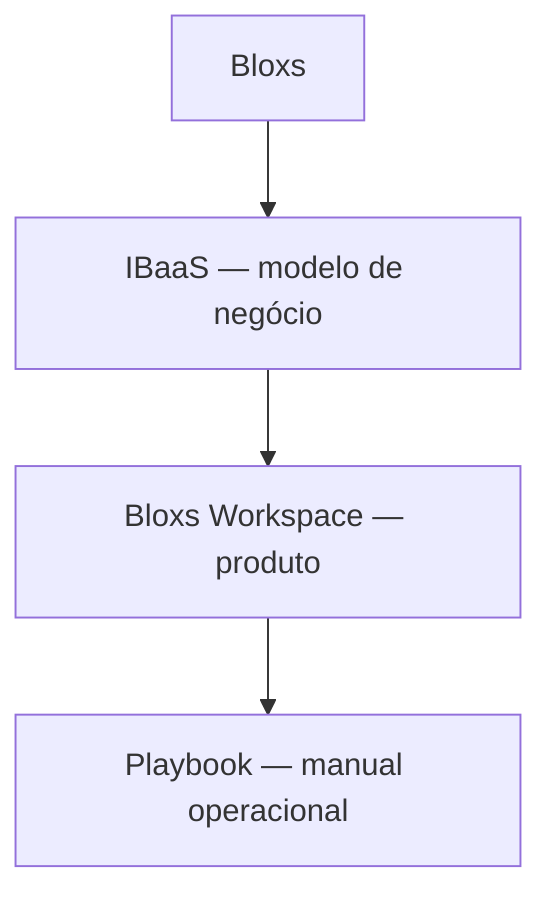

<Info>
  **Ao terminar esta página, você consegue:** separar o produto que a Bloxs opera (Workspace) das ferramentas de infraestrutura que apenas usamos, e saber onde cada tarefa vive.
</Info>

## O que é isso

Este domínio tem duas camadas que nunca devem ser confundidas:

<CardGroup cols={2}>
  <Card title="Bloxs Workspace — nosso produto" icon="display" href="/ferramentas/workspace/index">
    A Plataforma IBaaS da Bloxs. É onde todos os atores operam. É produto, não ferramenta.
  </Card>

  <Card title="Infraestrutura — o que usamos" icon="plug" href="/ferramentas/infra/index">
    HubSpot, Google Workspace, ClickUp e o restante do stack. Não é nosso produto; é apoio.
  </Card>
</CardGroup>

## A hierarquia que organiza tudo

O **Workspace** é a plataforma através da qual operamos o modelo IBaaS. O **Playbook** (este ambiente) é o manual de como operar. São coisas distintas: um é onde se trabalha, o outro é onde se aprende a trabalhar.

## Por que a separação importa

<Warning>
  Confundir Workspace com infraestrutura é erro grave de posicionamento. O Workspace é o que vendemos e onde o parceiro opera. HubSpot ou ClickUp são ferramentas internas que poderiam ser trocadas sem mudar o que a Bloxs é. Nunca tratar o Workspace como "só mais uma ferramenta".
</Warning>

## Para onde ir agora

<CardGroup cols={2}>
  <Card title="Bloxs Workspace" icon="display" href="/ferramentas/workspace/index">
  </Card>

  <Card title="Infraestrutura" icon="plug" href="/ferramentas/infra/index">
  </Card>

  <Card title="Como a Máquina Gira" icon="gears" href="/maquina/revops">
  </Card>
</CardGroup>