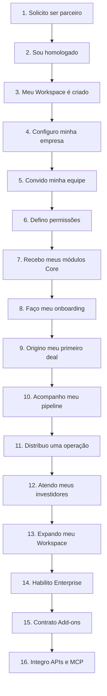

<Info>
  **Ao terminar esta página, você consegue:** explicar o Workspace pela jornada de quem opera nele — e mostrar onde cada capacidade entra, sem transformar o produto num catálogo de módulos.
</Info>

## O que é isso

O **Bloxs Workspace** é a **Plataforma IBaaS da Bloxs** — o produto através do qual o parceiro opera o modelo de negócio. Mas ninguém compra "CRM" ou "Data Room". O parceiro compra a **capacidade de operar seu negócio de mercado de capitais**. Por isso documentamos o Workspace pela jornada dele — e deixamos os módulos aparecerem como consequência.

## A jornada do parceiro no Workspace

## A jornada, passo a passo — e o que cada passo ativa

| # | O parceiro… | Capacidade que aparece | Camada |
| --- | --- | --- | --- |
| 1–2 | Solicita ser parceiro e é homologado | [Cadastro do Parceiro](/ferramentas/workspace/cadastro-parceiro) | Getting Started |
| 3 | Tem o Workspace criado | Provisionamento da conta | Core |
| 4 | Configura a empresa | [Configuração & Administração](/ferramentas/workspace/administracao) | Core |
| 5–6 | Convida equipe e define permissões | Usuários, Perfis, Permissões | Core |
| 7 | Recebe os módulos Core | [Capacidades Core](/ferramentas/workspace/capacidades) | Core |
| 8 | Faz o onboarding | Onboarding do Workspace \+ [Academy](/aprender/onboarding) | Core |
| 9 | Origina o primeiro deal | CRM, Contas, Deals | Core |
| 10 | Acompanha o pipeline | Pipeline | Core |
| 11 | Distribui uma operação | Deal Match, Documentos, Data Room | Core |
| 12 | Atende investidores | CRM de investidores, reporting | Core |
| 13 | Expande o Workspace | Mais capacidades por necessidade | Core → Enterprise |
| 14 | Habilita Enterprise | [Enterprise Capabilities](/ferramentas/workspace/enterprise-capabilities) | Enterprise |
| 15 | Contrata Add-ons | [Add-ons](/ferramentas/workspace/add-ons) | Add-on |
| 16 | Integra APIs/MCP | [Developer / Tech](/ferramentas/workspace/developer-tech) | Enterprise/Dev |

<Info>
  Repare: os módulos (CRM, Pipeline, Data Room) não são o ponto de partida — eles **aparecem quando a jornada precisa deles**. O parceiro não "aprende o CRM"; ele origina um deal, e o CRM é o que torna isso possível.
</Info>

## O que o Workspace precisa ensinar

O Workspace não deve ser apresentado como lista de telas. Ele é o manual vivo de operação do IBaaS em software. Cada capacidade precisa responder a seis perguntas:

| Pergunta | Função |
| --- | --- |
| Qual problema operacional resolve? | Define por que a capacidade existe |
| Quem usa? | Separa parceiro, Bloxs, Enterprise, mesa, operações e devs |
| Em qual momento da jornada aparece? | Evita feature solta sem contexto |
| Qual dado vira fonte de verdade? | Define registro, auditoria e automação |
| Qual decisão habilita? | Mostra valor prático da capacidade |
| Qual risco reduz? | Conecta produto a governança |

<Info>
  A plataforma só é IBaaS se reduzir fricção operacional **e** preservar perímetro regulatório. Feature que gera escala mas enfraquece governança não é capacidade institucional.
</Info>

## Fonte de verdade e trilha operacional

A jornada do Workspace deve deixar claro onde cada verdade vive:

| Objeto | Fonte de verdade esperada | Uso |
| --- | --- | --- |
| Parceiro | Workspace / cadastro de conta | Homologação, permissões e contrato |
| Conta B2B | Account OS / CRM operacional | Recorrência, expansão, relacionamento e health score |
| Deal | Pipeline / Deal OS | Estágio, dono, decisão pendente e histórico |
| Documento | Data Room / repositório controlado | Evidência, versão e aprovação |
| Investidor | Módulo buy side, quando aplicável | Suitability, relacionamento e distribuição autorizada |
| Evento | Logs, webhooks e automações | Auditoria, notificações e integrações |

## A plataforma é modular

A jornada revela três camadas de capacidade. Documentadas em detalhe em:

<CardGroup cols={3}>
  <Card title="Core" icon="cube" href="/ferramentas/workspace/capacidades">
    O que todo parceiro recebe. Sustenta os passos 3–13 da jornada.
  </Card>

  <Card title="Enterprise" icon="building" href="/ferramentas/workspace/enterprise-capabilities">
    Liberado por contratação. Passo 14.
  </Card>

  <Card title="Add-ons" icon="puzzle-piece" href="/ferramentas/workspace/add-ons">
    Opcional. Passo 15.
  </Card>
</CardGroup>

## Regras da casa aqui

<Warning>
  A atividade regulada (emissão, coordenação, gestão) permanece nas entidades Bloxs, em qualquer passo da jornada e sob qualquer marca. A plataforma é o trilho; a licença é das entidades. Ver [O Perímetro](/produtos/perimetro/originacao-vs-atividade-regulada).
</Warning>

## Para onde ir agora

<CardGroup cols={2}>
  <Card title="Cadastro do Parceiro (comece aqui)" icon="rocket" href="/ferramentas/workspace/cadastro-parceiro">
  </Card>

  <Card title="Capacidades Core" icon="grip" href="/ferramentas/workspace/capacidades">
  </Card>

  <Card title="Arquitetura Modular" icon="cubes" href="/ferramentas/workspace/arquitetura-modular">
  </Card>

  <Card title="Developer / Tech" icon="code" href="/ferramentas/workspace/developer-tech">
  </Card>
</CardGroup>