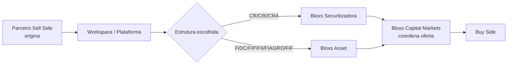

<Info>
  **Ao terminar esta página, você consegue:** para qualquer atividade regulada (emitir, gerir, coordenar, distribuir, tokenizar), dizer qual entidade Bloxs a executa, sob qual base regulatória, quem é responsável e onde a operação vive.
</Info>

<Warning>
  Este é o manual operacional. Detalhes societários e habilitações específicas devem ser confirmados com Jurídico antes de qualquer comunicação externa.
</Warning>

## Em uma frase

O Grupo Bloxs opera por meio de **entidades reguladas distintas**, cada uma com autorização própria — Securitizadora, Asset (gestora), Capital Markets (coordenadora) e camadas complementares — de modo que a atividade regulada **sempre tem um dono habilitado**, e nunca é executada por parceiro ou colaborador sem licença.

## Por que isso existe na Bloxs

Sem entidades bem separadas, o perímetro vira teoria. A separação faz três coisas:

1. **Ancora a atividade regulada** em uma pessoa jurídica que responde pelo ato.
2. **Isola risco** — problema em uma entidade não contamina automaticamente as outras.
3. **Habilita a escala** — o parceiro sabe exatamente quem está do outro lado de cada operação.

## Como a Bloxs enxerga

Uma entidade executora **não é caixinha de organograma**; é **responsável regulatório**. Toda atividade regulada tem um dono habilitado, com trilha auditável e ponto de escalação claro.

Três princípios editoriais:

- **Cada atividade regulada tem uma única entidade responsável.** Não existe atividade "compartilhada" sem definição de dono.
- **White-label é marca, não licença.** A entidade regulada permanece na Bloxs.
- **Parceiro não substitui entidade regulada.** Origina, apresenta, encaminha — não executa.

## As entidades

### Bloxs Securitizadora

- **Autorização:** RCVM 60 (Companhia Securitizadora de Direitos Creditórios).
- **Atividades executadas:** emissão de **CR, CRI, CRA**, estruturação de operações lastreadas em direitos creditórios; operações com camada **Digital Assets** sobre esses instrumentos.
- **Não faz:** gestão de fundo; coordenação de oferta pública (executa junto com a Capital Markets quando cabível).
- **Responde por:** conformidade da emissão, do lastro e do agente fiduciário; obrigações de registro e reporting sobre os títulos emitidos.
- **Onde a operação vive:** Workspace \+ registros CVM \+ agente fiduciário.

### Bloxs Asset

- **Autorização:** RCVM 175 / RCVM 21 (administração / gestão de recursos, conforme escopo habilitado).
- **Atividades executadas:** gestão e/ou administração de **FIDC, FIDC Multiclasse, FII, FIP, FIAGRO, FIF**.
- **Não faz:** securitização de direitos creditórios em título próprio (isso é Securitizadora); coordenação de oferta pública.
- **Responde por:** política de investimento, elegibilidade de ativos, precificação, reporting de fundo.
- **Onde a operação vive:** Workspace \+ administradora \+ CVM.

### Bloxs Capital Markets

- **Autorização:** RCVM 161 (Coordenação de Ofertas Públicas de Valores Mobiliários).
- **Atividades executadas:** **coordenação e distribuição** de ofertas públicas (RCVM 160) e ofertas dispensadas com esforços restritos; condução de **book, roadshow, alocação**; interlocução institucional com **Buy Side**.
- **Não faz:** emitir título (Securitizadora); gerir fundo (Asset); recomendar investimento (assessor licenciado, sujeito a suitability).
- **Responde por:** enquadramento do regime da oferta, aprovação e uso de material, condução do book, evidência de esforço de venda dentro do regime.
- **Onde a operação vive:** Workspace \+ CVM \+ livro da oferta.

### Bloxs (Plataforma / Tecnologia)

- **Natureza:** entidade **não regulada** da linha regulatória de valores mobiliários. Presta **tecnologia, produto, serviços e IBaaS**, incluindo contratos white-label com Enterprise.
- **Atividades executadas:** Workspace, Developer Platform, integrações, copilotos, contratos de tecnologia, comercialização de licenças de plataforma.
- **Não faz:** qualquer atividade privativa de entidade regulada.
- **Responde por:** disponibilidade, segurança, sigilo, LGPD, SLA contratual.
- **Onde a operação vive:** contrato \+ Workspace \+ logs.

## Matriz — atividade × entidade

| Atividade regulada | Entidade Bloxs responsável | Base |
| --- | --- | --- |
| Emitir CR / CRI / CRA | Bloxs Securitizadora | RCVM 60 |
| Estruturar operação lastreada em direitos creditórios | Bloxs Securitizadora | RCVM 60 |
| Emitir camada Digital Assets sobre CR/CRI/CRA | Bloxs Securitizadora (\+ Tokenizadora habilitada) | RCVM 60 \+ habilitação específica |
| Gerir FIDC / FIDC Multiclasse | Bloxs Asset | RCVM 175 / 21 |
| Gerir FII | Bloxs Asset | RCVM 175 / 21 |
| Gerir FIP | Bloxs Asset | RCVM 175 / 21 |
| Gerir FIAGRO / FIF | Bloxs Asset | RCVM 175 / 21 |
| Coordenar oferta pública | Bloxs Capital Markets | RCVM 161 \+ RCVM 160 |
| Conduzir book / roadshow / alocação | Bloxs Capital Markets | RCVM 161 |
| Interlocução institucional com Buy Side | Bloxs Capital Markets | RCVM 161 |
| Prestar tecnologia / Workspace / IBaaS | Bloxs (Plataforma) | Contratual |
| Contrato white-label com Enterprise | Bloxs (Plataforma) | Contratual — marca, não licença |

## Como as entidades se combinam num deal típico

Uma mesma operação pode envolver **Securitizadora \+ Capital Markets** (título securitizado com oferta coordenada), **Asset \+ Capital Markets** (cotas de fundo com oferta coordenada), ou apenas uma delas conforme o desenho.

## Critérios de decisão — quem executa

- **Direitos creditórios em título securitizado** → Bloxs Securitizadora.
- **Carteira em veículo de fundo** → Bloxs Asset.
- **Oferta ao mercado** (público ou público profissional) → Bloxs Capital Markets.
- **Camada tecnológica / plataforma** → Bloxs (Plataforma).
- **Digital Assets** → Securitizadora \+ habilitação específica de tokenização.
- **Dúvida sobre enquadramento** → Compliance define antes da execução.

## Papéis e responsabilidades

| Domínio | Cabeça de entidade | Responsável regulatório | Aprovação de comunicação | Registro |
| --- | --- | --- | --- | --- |
| Securitização | Diretoria da Securitizadora | Compliance \+ DRI | Compliance | CVM \+ agente fiduciário |
| Gestão de fundos | Diretoria da Asset | Compliance \+ DRI | Compliance | Administradora \+ CVM |
| Coordenação | Diretoria da Capital Markets | Compliance \+ DRI | Compliance | Livro da oferta \+ CVM |
| Plataforma | Diretoria de Produto/Tecnologia | Segurança \+ Compliance | Comercial \+ Jurídico | Contrato \+ logs |

## Riscos e red flags

<Warning>
  **Sinais de má compreensão das entidades:**

  - Colaborador falando "a Bloxs" como se fosse uma única pessoa jurídica em contexto regulatório sensível.
  - Enterprise apresentando-se como se detivesse licença por ter contrato white-label.
  - Parceiro afirmando "sou representante da Bloxs Capital Markets" sem vínculo formal.
  - Confusão entre Securitizadora e Asset ao discutir instrumento vs veículo.
  - Uso de logo/marca de uma entidade em atividade de outra sem coordenação.
</Warning>

## Linguagem segura

✅ "A emissão do CR é feita pela Bloxs Securitizadora." ✅ "O FIDC é gerido pela Bloxs Asset." ✅ "A coordenação da oferta é da Bloxs Capital Markets." ✅ "O white-label é contrato com a Bloxs Plataforma — a atividade regulada permanece nas entidades reguladas." ❌ "A Bloxs faz tudo." (impreciso em contexto regulatório) ❌ "Nossa licença cobre isso." (sem especificar qual entidade e qual autorização)

## Registro obrigatório

- Entidade responsável por cada atividade em cada operação.
- Autorização regulatória invocada (RCVM aplicável).
- Aprovações internas da entidade correspondente.
- Comunicações externas em nome de cada entidade — sempre versionadas.

## Continue por aqui

<CardGroup cols={2}>
  <Card title="Perímetro Regulatório" href="/regras/perimetro-regulatorio">
    O mapa completo do que cada perfil pode fazer, ancorado nas entidades desta página.
  </Card>

  <Card title="Originação vs Regulada" href="/regras/originacao-vs-regulada">
    A linha que separa o que o parceiro origina do que a entidade executa.
  </Card>

  <Card title="Conduta por Perfil" href="/produtos/perimetro/conduta-por-perfil">
    Como cada perfil (parceiro, colaborador, Enterprise) se posiciona diante das entidades.
  </Card>

  <Card title="Distribuição e Oferta" href="/regras/distribuicao-e-oferta">
    O manual do regime dentro do qual a Coordenação atua.
  </Card>
</CardGroup>