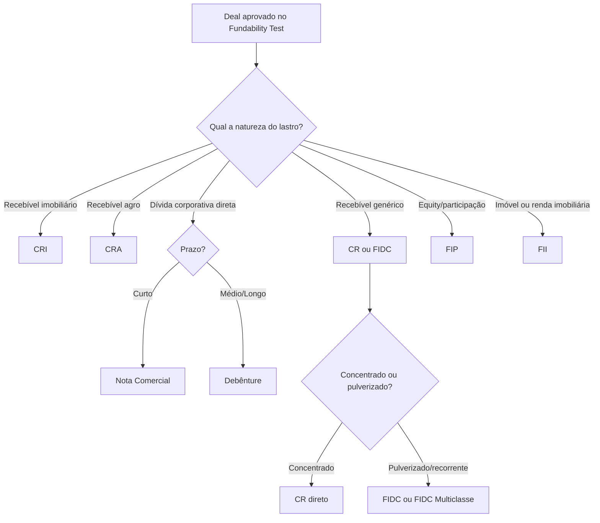

<Info>
  **Ao terminar esta página, você consegue:** pegar um deal financiável e apontar a estrutura provável — instrumento, veículo, regime, entidade — justificando por que ela e não as outras.
</Info>

## Em uma frase

A Selection Matrix é a decisão que traduz um deal financiável em uma estrutura executável, escolhendo entre CR, CRI, CRA, FIDC, FIDC Multiclasse, FIP, FII, FIAGRO, FIF, Debênture, Nota Comercial ou Digital Assets — com justificativa registrada.

## Por que isso existe na Bloxs

O mercado privado brasileiro costuma escolher estrutura pelo hábito do estruturador, não pela natureza do deal. Isso gera três problemas: operações que não fecham, custos regulatórios evitáveis e trilha auditável fraca. A Bloxs recusa esse padrão.

Toda estrutura sai de um processo de decisão registrado — o Fundability Test define **se** o deal é financiável, a Selection Matrix define **como** ele será estruturado. A separação é ontológica: instrumento, veículo, regime de oferta, solução comercial e camada tecnológica **respondem a perguntas diferentes** e nunca devem ser tratados como sinônimos.

## Como a Bloxs enxerga

Uma estrutura é o encontro de **cinco decisões independentes**:

| Decisão | Pergunta | Exemplo |
| --- | --- | --- |
| **Instrumento** | Que título representa o crédito? | CR, CRI, CRA, Debênture, Nota Comercial |
| **Veículo** | Onde o crédito é carregado? | FIDC, FIP, FII, FIAGRO, FIF |
| **Regime de oferta** | Como o público investidor acessa? | ICVM 88 / ICVM 160 / Público profissional |
| **Solução comercial** | Como isso é vendido ao parceiro? | CR Plataforma, Consultoria FIDC 360, Fundos On Demand |
| **Camada tecnológica** | Vai ser tokenizado? | Digital Assets sobre um instrumento existente |

**Digital Assets não é um instrumento paralelo.** É a camada digital sobre um dos instrumentos acima. Tokenizar um CR não muda a natureza jurídica — muda a infraestrutura de custódia e transferência.

## Como funciona na prática

Todo deal atravessa a matriz em ordem: primeiro Fundability, depois lastro, depois veículo, depois regime, depois entidade. Pular etapa gera retrabalho.

## Matriz por caso de uso

A tabela abaixo é a espinha da decisão. Cada linha considera dez dimensões: lastro, fluxo, prazo, recorrência, público-alvo, regime de oferta, entidade executora, custo relativo, governança e demanda esperada. As colunas destacam a decisão, o descarte e o red flag.

| Caso de uso | Estrutura provável | Quando usar | Quando NÃO usar | Entidade executora | Red flags |
| --- | --- | --- | --- | --- | --- |
| Empresa middle-market precisa de capital, lastro identificável | [CR](/produtos/cr) | Lastro concentrado, oferta a profissionais, agilidade | Se o lastro é pulverizado e recorrente | Bloxs Securitizadora | Forçar CR quando a carteira pede FIDC |
| Carteira pulverizada de recebíveis, gestão contínua | [FIDC](/produtos/fidc) | Pulverização, recorrência, subordinação, gestão viva | Se é operação única sem gestão | Bloxs Asset | Vender FIDC como se fosse título único |
| Múltiplas teses num só veículo, com segregação | [FIDC Multiclasse](/produtos/fidc-multiclasse) | Pipeline de várias teses do mesmo originador, isolamento de risco por classe | Se há apenas uma tese consolidada | Bloxs Asset | Confundir "várias classes" com "vários fundos" |
| Recebível imobiliário, público mais amplo | [CRI](/produtos/cri) | Lastro imobiliário elegível, benefício fiscal PF, oferta ampla | Se o lastro não é imobiliário elegível | Bloxs Securitizadora | Forçar CRI sem lastro imobiliário elegível |
| Recebível do agro, distribuição ampla | [CRA](/produtos/cra) | Lastro agro elegível, isenção PF | Se o lastro não é agro elegível | Bloxs Securitizadora | Forçar CRA fora da elegibilidade |
| Cadeia agro, mistura de recebível/imóvel/participação | [FIAGRO](/produtos/fiagro) | Tese agro em veículo de fundo | Se cabe em CRA isolado | Bloxs Asset | Sobrepor FIAGRO com CRA sem justificar |
| Imóvel físico ou fluxo de locação | [FII](/produtos/fii) | Ativo imobiliário; possível isenção sobre rendimentos PF | Se o ativo é o recebível (então é CRI) | Bloxs Asset | Confundir "imóvel" com "recebível imobiliário" |
| Participação societária, tese de equity | [FIP](/produtos/fip) | Entrada no capital, retorno via valorização e saída | Se é dívida ou recebível | Bloxs Asset | Vender FIP como se fosse dívida |
| Tese diversificada em ativos financeiros | [FIF](/produtos/fif) | Quando não é FIDC/FIP/FII específico | Se cabe num veículo dedicado | Bloxs Asset | Usar FIF como default por comodidade |
| Dívida corporativa direta, curto prazo | [Nota Comercial](/produtos/nota-comercial) | Prazo curto, agilidade, emissor S.A. ou LTDA | Se o prazo é longo ou exige covenants robustos | Bloxs Capital Markets (coord.) | Prazo longo em NC |
| Dívida corporativa direta, médio/longo prazo | [Debênture](/produtos/debenture) | Emissor S.A., prazo médio/longo, covenants | Se o emissor não é S.A. ou precisa de agilidade | Bloxs Capital Markets (coord.) | Debênture sem covenants adequados |
| Qualquer instrumento acima em infraestrutura digital | [Digital Assets](/produtos/digital-assets) | Quando a tokenização agrega custódia, transferência ou governança | Como produto autônomo separado | Bloxs Securitizadora e Tokenizadora | Vender "token" como se fosse novo tipo de lastro |

## Comparações-chave — por que este e não o outro

Cada comparação treina o reflexo de **justificar o descarte**, não só a escolha.

<AccordionGroup>
  <Accordion title="CR vs FIDC">
    **CR:** operação direta, lastro identificável, emissão via securitizadora — bom para lastro concentrado/definido. **FIDC:** veículo de carteira, gestão contínua, subordinação entre cotas — bom para pulverização e recorrência. Descartar CR quando a carteira é pulverizada e recorrente.
  </Accordion>

  <Accordion title="CRI vs CR">
    **CRI:** exige lastro imobiliário; isenção de IR para PF; público mais amplo. **CR:** flexível quanto ao lastro; sem o benefício fiscal. Descartar CRI quando o lastro não é imobiliário.
  </Accordion>

  <Accordion title="CRA vs FIDC agro">
    **CRA:** isenção de IR para PF, lastro agro, distribuição ampla. **FIDC agro/FIAGRO:** veículo de carteira, sem isenção para PF. Descartar CRA quando não há lastro agro elegível.
  </Accordion>

  <Accordion title="Debênture vs Nota Comercial">
    **Debênture:** emissor S.A., prazos médio/longo, covenants robustos. **Nota comercial:** mais simples e rápida, prazos curtos. Descartar debênture quando o emissor não é S.A. ou precisa de agilidade.
  </Accordion>

  <Accordion title="FIP vs FIDC">
    **FIP:** entra no capital (equity), retorno via valorização e saída. **FIDC:** financia o recebível (dívida), retorno via fluxo. Descartar FIP quando o que existe é dívida/recebível.
  </Accordion>
</AccordionGroup>

## Processo padrão — como o deal atravessa a matriz

<Steps>
  <Step title="Confirmar o Fundability">
    Sem aprovação no [Fundability Test](/produtos/fundability-test), a Selection Matrix não abre. Deal financiável com ajustes precisa dos ajustes registrados antes.
  </Step>
  <Step title="Classificar o lastro">
    Recebível imobiliário, agro, genérico, dívida corporativa, equity, imóvel/renda. É a decisão que abre a árvore.
  </Step>
  <Step title="Decidir instrumento vs veículo">
    Concentrado e definido → instrumento (CR/CRI/CRA/Debênture/NC). Pulverizado/recorrente → veículo (FIDC/multiclasse). Equity → FIP. Imobiliário direto → FII.
  </Step>
  <Step title="Definir o regime de oferta">
    Público profissional (ICVM 88), oferta pública (ICVM 160) ou distribuição restrita. Regime define público, material, prazos e obrigações regulatórias.
  </Step>
  <Step title="Confirmar entidade executora">
    Cada estrutura tem entidade responsável: Bloxs Securitizadora (RCVM 60), Bloxs Asset (RCVM 175/21) ou Bloxs Capital Markets (RCVM 161).
  </Step>
  <Step title="Registrar a decisão">
    Estrutura escolhida, alternativas descartadas com justificativa, entidade, regime, custo estimado — tudo no Workspace. Sem registro, não há memória e não há flywheel.
  </Step>
</Steps>

## Comparações-chave — por que este e não o outro

Cada comparação treina o reflexo de **justificar o descarte**, não só a escolha.

<AccordionGroup>
  <Accordion title="CR vs FIDC">
    **CR:** operação direta, lastro identificável, emissão via securitizadora — bom para lastro concentrado/definido. **FIDC:** veículo de carteira, gestão contínua, subordinação entre cotas — bom para pulverização e recorrência. Descartar CR quando a carteira é pulverizada e recorrente.
  </Accordion>

  <Accordion title="CRI vs CR">
    **CRI:** exige lastro imobiliário elegível; isenção de IR para PF; público mais amplo. **CR:** flexível quanto ao lastro; sem o benefício fiscal. Descartar CRI quando o lastro não é imobiliário elegível.
  </Accordion>

  <Accordion title="CRA vs FIAGRO">
    **CRA:** título de securitização, isenção PF, distribuição ampla. **FIAGRO:** veículo de fundo, permite mistura de recebível/imóvel rural/participação. Descartar CRA quando a tese é multi-ativo agro.
  </Accordion>

  <Accordion title="FIDC vs FIDC Multiclasse">
    **FIDC:** uma tese, uma carteira, hierarquia sênior/subordinada. **FIDC Multiclasse:** várias classes segregadas no mesmo veículo, cada uma com lastro e risco isolados. Descartar multiclasse quando há uma única tese consolidada.
  </Accordion>

  <Accordion title="Debênture vs Nota Comercial">
    **Debênture:** emissor S.A., prazos médio/longo, covenants robustos. **Nota Comercial:** mais simples e rápida, prazos curtos. Descartar debênture quando o emissor não é S.A. ou precisa de agilidade.
  </Accordion>

  <Accordion title="FIP vs FIDC">
    **FIP:** entra no capital (equity), retorno via valorização e saída. **FIDC:** financia o recebível (dívida), retorno via fluxo. Descartar FIP quando o que existe é dívida.
  </Accordion>

  <Accordion title="Digital Assets sobre CR">
    **Digital Assets** não substitui o CR — sobrepõe uma camada de tokenização (custódia, transferência, governança on-chain). O instrumento continua sendo o CR, sujeito ao mesmo regime.
  </Accordion>
</AccordionGroup>

## Critérios de decisão — quando avançar, ajustar, escalar ou recusar

- **Avança** quando lastro, prazo, público e entidade estão alinhados e o registro está completo.
- **Ajusta** quando o lastro é elegível mas o regime não fecha — trocar regime, não instrumento.
- **Escala** quando o caso é limítrofe entre duas estruturas ou envolve digital assets — leva ao comitê.
- **Recusa** quando a estrutura escolhida seria só para acomodar o hábito do parceiro, sem lastro real na dimensão que a estrutura pede.

## Papéis e responsabilidades

| Etapa | Faz | Decide | Aprova | Registra |
| --- | --- | --- | --- | --- |
| Classificar lastro | Estruturação | Estruturação | — | Workspace |
| Escolher instrumento/veículo | Estruturação | Comitê de Estruturação | Compliance quando toca oferta | Workspace |
| Definir regime | Estruturação \+ Compliance | Compliance | Compliance | Workspace \+ material aprovado |
| Confirmar entidade | Estruturação | Cabeça da entidade envolvida | Compliance | Workspace |

## Riscos e red flags

<Warning>
  **Sinais de escolha errada:**

  - Tratar regime de oferta como se fosse instrumento.
  - Forçar CRI/CRA sem lastro elegível pela isenção.
  - Vender "token" como se fosse novo tipo de lastro.
  - Escolher FIDC porque "todo mundo faz FIDC" sem justificar contra CR.
  - Prometer distribuição de varejo sem checar o regime.
  - Escolher instrumento antes do Fundability Test estar aprovado.
</Warning>

## Linguagem segura

✅ "Este deal é candidato a CR ou FIDC; escolhemos CR porque o lastro é concentrado." ✅ "O regime da oferta é público profissional — o material segue essa premissa." ✅ "Digital Assets é a camada tecnológica sobre o CR; o instrumento é o CR." ❌ "Vamos fazer um token." (token não é instrumento — sempre é sobre algo) ❌ "Vamos rodar como CRI para dar isenção." (isenção não é premissa, é consequência da elegibilidade) ❌ "Vamos distribuir amplo." (regime não é escolha comercial; é regulatória)

## Registro obrigatório

Toda decisão de estrutura registra no Workspace, em campos separados:

- Estrutura escolhida (instrumento \+ veículo, se aplicável).
- Alternativas consideradas e razão de descarte.
- Regime de oferta e entidade executora.
- Custo relativo estimado.
- Aprovações de Estruturação e Compliance.
- Link para o Fundability Test correspondente.

## Continue por aqui

<CardGroup cols={2}>
  <Card title="Fundability Test" href="/produtos/fundability-test">
    A porta de entrada — todo deal passa por aqui antes da Selection Matrix.
  </Card>

  <Card title="Entidades Executoras" href="/produtos/perimetro/entidades-executoras">
    Quem executa cada estrutura na Bloxs — Securitizadora, Asset ou Coordenação.
  </Card>

  <Card title="A Jornada Completa do Deal" href="/deal/index">
    Como o deal caminha depois da Selection Matrix — estruturação, modelagem, distribuição.
  </Card>

  <Card title="O Perímetro Regulatório" href="/regras/perimetro-regulatorio">
    Onde a Bloxs pode atuar e onde a atividade é privativa de entidade licenciada.
  </Card>
</CardGroup>