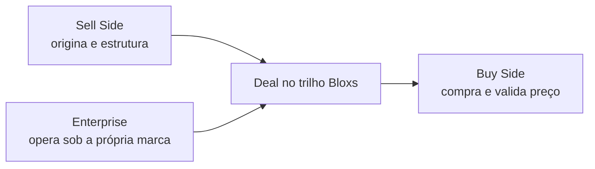

<Info>
  **Ao terminar esta página, você consegue:** identificar com qual dos três perfis você está lidando e saber o que cada um faz no modelo — sem misturá-los.
</Info>

## Os três não são departamentos

Sell Side, Buy Side e Enterprise são **partes do modelo de negócio**, não caixinhas do organograma. Eles se relacionam no mesmo trilho e é o encontro deles que fecha o ciclo econômico.

## Sell Side — o motor

É o **principal cliente do IBaaS**. Origina operações, estrutura com a Bloxs, atende empresas e ganha fees. É onde a conta B2B nasce e a receita recorrente se forma.

<Check>
  Boutiques de IB, assessorias, gestoras, originadores, servicers
</Check>

## Buy Side — a validação e a liquidez

**Não é cliente do IBaaS — é o lado comprador do mercado.** Compra os deals, fundos e estruturas. Valida o preço e dá saída à operação. Não é canal de varejo — é confirmação de apetite institucional real.

<Check>
  Investidores institucionais, gestoras alocadoras, family offices qualificados
</Check>

<Warning>
  Nunca misture Buy Side com Enterprise. Um compra; o outro opera a própria plataforma. São papéis opostos no modelo.
</Warning>

## Enterprise — a infraestrutura white-label

Uma instituição que quer **operar a própria plataforma** de mercado de capitais usando o trilho da Bloxs, sob a própria marca. Origina em escala e controla a experiência — mas a atividade regulada permanece nas entidades Bloxs.

<Check>
  Gestoras, bancos médios, wealths, securitizadoras, plataformas digitais
</Check>

## Como o ciclo fecha

O Sell Side origina e estrutura. O Buy Side compra e valida. O Enterprise amplia a origem operando sob marca própria. Cada operação no trilho torna a próxima mais barata — é o [flywheel](/quem-somos/o-flywheel).

## O que respeitar

<Warning>
  Buy Side não é canal de varejo. Enterprise não é revenda de licença. Sell Side não substitui a atividade regulada. Confundir os três quebra o modelo.
</Warning>

## Para onde ir agora

<CardGroup cols={2}>
  <Card title="Sell Side em detalhe" color="#033873" icon="arrow-up-right-dots" href="/quem-somos/ecossistema/sell-side">
    Quem origina e estrutura sobre o trilho — o principal cliente do IBaaS.
  </Card>

  <Card title="Buy Side em detalhe" color="#2E61FF" icon="magnifying-glass-dollar" href="/quem-somos/ecossistema/buy-side">
    Quem compra e valida preço — o lado comprador institucional do trilho.
  </Card>

  <Card title="Enterprise em detalhe" color="#033873" icon="building" href="/quem-somos/ecossistema/enterprise">
    Quem opera a própria plataforma sob marca própria usando o trilho da Bloxs.
  </Card>

  <Card title="O Flywheel" color="#2E61FF" icon="rotate" href="/quem-somos/o-flywheel">
    Como o encontro dos três perfis torna cada nova operação mais barata que a anterior.
  </Card>
</CardGroup>