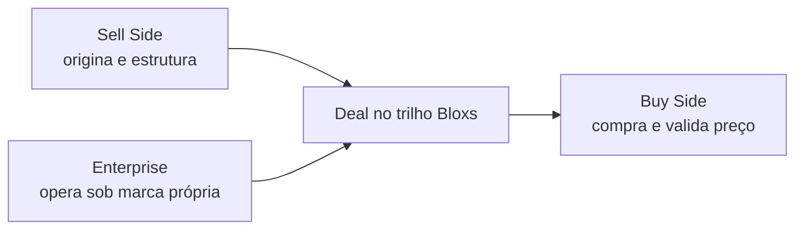

<Info>
  **Ao terminar esta página, você consegue:** identificar em qualquer conversa se está lidando com Sell Side, Buy Side ou Enterprise, aplicar a linguagem correta para cada um e reconhecer imediatamente quando alguém confunde os papéis.
</Info>

## Em uma frase

Sell Side origina, Buy Side compra, Enterprise opera sob a própria marca — três contrapartes distintas do mesmo modelo, com funções econômicas, guardrails e linguagem que nunca se misturam.

## Por que isso existe na Bloxs

A Bloxs opera um trilho de mercado de capitais que só funciona quando três contrapartes distintas se encontram: quem origina a demanda por capital, quem oferta capital, e quem quer operar essa dinâmica sob marca própria. Confundir as três é o erro mais caro do modelo — porque cada uma tem um guardrail regulatório, comercial e reputacional diferente.

Historicamente, o mercado privado brasileiro tratou essas contrapartes como "clientes" indistintos. A Bloxs recusa essa simplificação. Sell Side é cliente do IBaaS. Buy Side é contraparte institucional. Enterprise é cliente de plataforma. Cada relação tem contrato, discurso, receita e risco próprios.

## Como a Bloxs enxerga

Uma contraparte é uma **função econômica**, não um perfil de empresa. A mesma instituição pode aparecer como Sell Side em um deal e Buy Side em outro. O que define o papel é o que ela faz no trilho naquele momento, não seu CNPJ.

O modelo Bloxs só se sustenta quando cada contraparte é tratada pelo que ela é:

- **Sell Side origina** — traz a demanda por capital e estrutura a operação.
- **Buy Side compra e valida** — dá liquidez e confirma o preço.
- **Enterprise opera** — usa o trilho para rodar a própria operação sob marca própria.

## Como funciona na prática

### Sell Side — o motor

É o **principal cliente do IBaaS**. Origina operações, estrutura com a Bloxs, atende empresas tomadoras e ganha fees. É onde a conta B2B nasce e a receita recorrente se forma.

Quem tipicamente aparece: boutiques de investment banking, assessorias financeiras, gestoras que originam, servicers, originadores independentes.

### Buy Side — a validação e a liquidez

**Não é cliente do IBaaS.** É o **lado comprador do mercado**. Compra os títulos, cotas e estruturas que a Bloxs coordena. Valida preço, define apetite e dá saída à operação. Não é canal de varejo — é confirmação institucional de demanda.

Quem tipicamente aparece: investidores institucionais, gestoras alocadoras, family offices qualificados, tesourarias corporativas.

### Enterprise — a plataforma sob marca própria

Uma instituição que quer **operar a própria plataforma** de mercado de capitais usando o trilho técnico da Bloxs, sob marca própria (white-label). Origina em escala. **A marca é dela; a atividade regulada permanece nas entidades Bloxs quando aplicável.**

Quem tipicamente aparece: gestoras, bancos médios, wealths, securitizadoras próprias, plataformas digitais de crédito.

## Matriz das contrapartes

| Contraparte | Função econômica | O que faz | O que não faz | Risco de confusão | Guardrail |
| --- | --- | --- | --- | --- | --- |
| **Sell Side** | Origina demanda por capital | Traz o tomador, estrutura o deal com a Bloxs, atende a empresa e recebe fees. É a conta B2B recorrente do IBaaS. | Não coloca a operação no mercado sem coordenação regulada. Não distribui valor mobiliário sem licença. | Ser tratado como se pudesse exercer atividade privativa da coordenadora. | Origina livremente; distribuição/oferta pública é privativa da entidade licenciada Bloxs Capital Markets. |
| **Buy Side** | Compra e valida preço | Analisa, precifica, aloca e compra a operação coordenada. Valida apetite institucional. | Não é cliente do IBaaS. Não recebe pitch de plataforma. Não paga fee de IBaaS. | Ser tratado como cliente comercial ou como canal de varejo. | Comunicação institucional e informativa apenas — nunca esforço de venda fora do regime da oferta. |
| **Enterprise** | Opera plataforma sob marca própria | Contrata white-label da plataforma. Origina em escala usando o trilho técnico Bloxs sob sua própria marca. Paga tecnologia \+ serviços. | Não detém licença regulatória da Bloxs. Não distribui valor mobiliário como se fosse coordenador. Não sublicencia. | Achar que white-label carrega licença regulatória embutida. | White-label é marca, não licença — atividade regulada permanece nas entidades Bloxs. |

## Critérios de decisão — quem é o quê

Diante de uma conversa nova, identifique a contraparte respondendo três perguntas:

1. **Quem está trazendo o tomador?** → Sell Side.
2. **Quem vai comprar a operação estruturada?** → Buy Side.
3. **Quem quer operar sob a própria marca usando o trilho?** → Enterprise.

Se a mesma instituição responde "sim" a mais de uma pergunta, ela **aparece como contrapartes distintas em momentos distintos** — nunca como duas coisas ao mesmo tempo no mesmo deal.

## Papéis e responsabilidades

| Contraparte | Quem cuida da relação | Quem decide o avanço | Quem aprova comunicação | Onde se registra |
| --- | --- | --- | --- | --- |
| Sell Side | Comercial \+ Account | Comercial → Estruturação | Compliance nos materiais | HubSpot \+ Workspace |
| Buy Side | Coordenação (Bloxs Capital Markets) | Coordenação com apoio Compliance | Compliance obrigatório em qualquer material | Workspace (memória de mercado, apetite) |
| Enterprise | Account Enterprise \+ Produto | Produto \+ Comercial | Compliance nos materiais que tocam oferta | Workspace \+ HubSpot |

## Riscos e red flags

<Warning>
  **Sinais de confusão perigosa entre contrapartes:**

  - Prometer distribuição/colocação a um Sell Side ("a gente distribui pra você").
  - Fazer pitch de plataforma para Buy Side.
  - Sugerir a um Enterprise que o white-label inclui a licença regulatória.
  - Tratar Buy Side como canal de varejo.
  - Materiais comerciais circulando entre Buy Side sem aprovação de compliance.
  - Enterprise falando "oficialmente pela Bloxs" ao mercado.
</Warning>

## Linguagem segura

<Tabs>
  <Tab title="Sell Side">
    ✅ "Você origina o deal, a Bloxs estrutura e coordena." ✅ "A conta é sua; a coordenação regulada é nossa." ❌ "A gente distribui pra você." (promessa proibida) ❌ "Você pode ofertar direto ao investidor." (fora do perímetro)
  </Tab>
  <Tab title="Buy Side">
    ✅ "Estamos coordenando uma operação com este perfil — posso compartilhar o material?" ✅ "Este é o regime da oferta; o material é institucional." ❌ "Vou te vender essa operação." (esforço de venda indevido) ❌ "Rentabilidade estimada de X%." (promessa proibida)
  </Tab>
  <Tab title="Enterprise">
    ✅ "Você opera sob a sua marca; o trilho técnico e a atividade regulada permanecem na Bloxs." ✅ "White-label é marca, não licença." ❌ "Você passa a poder distribuir valor mobiliário." (fora do perímetro) ❌ "Sua licença cobre isso." (afirmação regulatória indevida)
  </Tab>
</Tabs>

## Como o ciclo fecha

O Sell Side origina. O Buy Side compra e valida. O Enterprise amplia a origem operando sob marca própria. Cada operação no trilho torna a próxima mais barata — é o mecanismo do [flywheel](/quem-somos/o-flywheel).

## Registro obrigatório

Toda relação com qualquer contraparte precisa deixar trilha na plataforma. **A memória institucional é ativo estratégico** — sem registro, não há flywheel.

- **Sell Side** — pipeline, conta, deals, próximos passos: [Registro na Plataforma](/como-vendemos/registro-plataforma).
- **Buy Side** — apetite, alocações, feedback de preço: registro no Workspace.
- **Enterprise** — contrato, adoção, expansão: registro no Workspace \+ HubSpot.

## Continue por aqui

<CardGroup cols={2}>
  <Card title="Sell Side em detalhe" href="/quem-somos/ecossistema/sell-side">
    Quem origina sobre o trilho — o principal cliente do IBaaS.
  </Card>

  <Card title="Buy Side em detalhe" href="/quem-somos/ecossistema/buy-side">
    Quem compra e valida preço — o lado comprador institucional.
  </Card>

  <Card title="Enterprise em detalhe" href="/quem-somos/ecossistema/enterprise">
    Quem opera a própria plataforma sob marca própria usando o trilho Bloxs.
  </Card>

  <Card title="O Flywheel" href="/quem-somos/o-flywheel">
    Como o encontro das três contrapartes torna cada operação mais barata que a anterior.
  </Card>
</CardGroup>