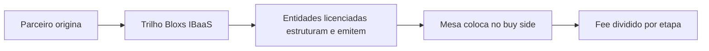

<Info>
  **Ao terminar esta página, você consegue:** explicar IBaaS a um parceiro e mostrar, concretamente, o que ele passa a fazer ao plugar no trilho da Bloxs.
</Info>

## O que é IBaaS

**IBaaS — Investment Banking as a Service.** A Bloxs entrega a capacidade de um banco de investimento — originação, estruturação, distribuição e acompanhamento — como **serviço**, sobre um trilho regulado. O parceiro pluga na plataforma e passa a **operar como um banco de investimento, sem ser um**: sem constituir securitizadora, coordenadora ou back-office próprios.

<Info>
  IBaaS é a categoria oficial da Bloxs. O termo "CMaaS" foi descontinuado — usar sempre **IBaaS**.
</Info>

## O que o parceiro passa a fazer

IBaaS não entrega uma licença ao parceiro. Entrega um **trilho operacional, tecnológico e regulatório** para que ele consiga atuar no mercado de capitais privado com padrão institucional, sem montar sozinho uma securitizadora, uma coordenadora, uma gestora, uma mesa, um back-office e uma camada de produto.

Na prática, o parceiro passa a conseguir:

| Capacidade | O que o parceiro faz | O que permanece com a Bloxs |
| --- | --- | --- |
| Originar oportunidades | Identifica empresas, ativos, carteiras, recebíveis, teses e demandas de funding | Define se a oportunidade entra no perímetro e se merece mandato |
| Qualificar o caso | Coleta informações iniciais, contexto, documentos e objetivo econômico | Aplica Fundability Test, critérios de risco, reputação e governança |
| Roteirar a estrutura | Ajuda a entender se o caso parece CR, CRI, CRA, FIDC, fundo, dívida ou plataforma | Valida instrumento, veículo, entidade executora e regime aplicável |
| Acompanhar pipeline | Registra oportunidade, status, pendências, documentos e próximos passos | Mantém fonte oficial, trilha de auditoria e governança da execução |
| Participar da relação | Mantém relacionamento com originador, cliente ou conta B2B | Controla atividades reguladas, comunicação sensível e aprovações |
| Escalar recorrência | Transforma operação pontual em conta, programa, série, veículo ou esteira | Estrutura a recorrência com governança, contrato, tecnologia e entidades licenciadas |

<Info>
  O parceiro opera **com a Bloxs**, não "como se fosse a Bloxs". Essa diferença protege a licença, a reputação e a relação econômica.
</Info>

## O que o parceiro não passa a poder fazer

O trilho IBaaS não transforma parceiro em securitizadora, coordenador, gestor, distribuidor ou consultor regulado. A plataforma amplia capacidade operacional; não transfere autorização regulatória.

<Warning>
  O parceiro não pode prometer aprovação, rentabilidade, liquidez, distribuição, colocação, recompra, garantia de funding ou acesso automático ao buy side. Também não pode se apresentar como entidade licenciada da Bloxs ou executar atividade regulada em nome próprio.
</Warning>

## O manual de operação do modelo

Leia IBaaS sempre por papéis, não por slogans:

| Papel | Função no modelo | Risco típico | Guardrail |
| --- | --- | --- | --- |
| Sell Side / Originador | Traz oportunidade e relacionamento | Cruzar a linha entre originar e distribuir | Origina; não oferta valor mobiliário |
| Bloxs | Estrutura, governa, executa e registra o trilho | Assumir deal ruim por pressão comercial | Reputação acima do deal |
| Entidade licenciada | Executa atividade privativa conforme licença | Misturar papéis regulados | Cada entidade atua dentro do próprio perímetro |
| Buy Side | Avalia e investe, quando aplicável | Ser tratado como cliente do IBaaS | É contraparte/investidor, não cliente de plataforma |
| Enterprise | Usa plataforma sob marca ou operação própria | Confundir white-label com licença | White-label é marca; licença continua na entidade regulada |

## Como isso se separa do que é regulado

O parceiro **origina**. As **entidades licenciadas da Bloxs executam a atividade regulada** (emitir, estruturar, coordenar, gerir). Essa linha é o coração da segurança da operação — e nunca se cruza.

<Warning>
  Ter o trilho não é ter licença. O parceiro nunca emite, distribui ou recomenda em nome próprio sem autorização. Veja o [Perímetro](/produtos/perimetro/originacao-vs-atividade-regulada).
</Warning>

## Onde IBaaS se encaixa no todo

## Para onde ir agora

<CardGroup cols={2}>
  <Card title="Como a Bloxs ganha dinheiro" color="#033873" icon="coins" href="/quem-somos/como-ganhamos-dinheiro">
    Os motores de receita do IBaaS — set up, success fee, coordenação e gestão.
  </Card>

  <Card title="O Flywheel" color="#2E61FF" icon="rotate" href="/quem-somos/o-flywheel">
    Como originação, estruturação e distribuição se reforçam e viram vantagem composta.
  </Card>

  <Card title="As Contrapartes" color="#033873" icon="diagram-project" href="/quem-somos/ecossistema/visao-geral">
    Quem opera sobre o trilho — parceiros, originadores, buy side — e o papel de cada um.
  </Card>

  <Card title="O Perímetro" color="#2E61FF" icon="scale-balanced" href="/produtos/perimetro/originacao-vs-atividade-regulada">
    A fronteira legal entre originar (parceiro) e exercer atividade regulada (Bloxs).
  </Card>
</CardGroup>