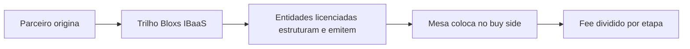

<Info>
  **Ao terminar esta página, você consegue:** explicar IBaaS a um parceiro e mostrar, concretamente, o que ele passa a fazer ao plugar no trilho da Bloxs.
</Info>

## O que é IBaaS

**IBaaS — Investment Banking as a Service.** A Bloxs entrega a capacidade de um banco de investimento — originação, estruturação, distribuição e acompanhamento — como **serviço**, sobre um trilho regulado. O parceiro pluga na plataforma e passa a **operar como um banco de investimento, sem ser um**: sem constituir securitizadora, coordenadora ou back-office próprios.

<Info>
  IBaaS é a categoria oficial da Bloxs. O termo "CMaaS" foi descontinuado — usar sempre **IBaaS**.
</Info>

## O que o parceiro passa a fazer

## Como isso se separa do que é regulado

O parceiro **origina**. As **entidades licenciadas da Bloxs executam a atividade regulada** (emitir, estruturar, coordenar, gerir). Essa linha é o coração da segurança da operação — e nunca se cruza.

<Warning>
  Ter o trilho não é ter licença. O parceiro nunca emite, distribui ou recomenda em nome próprio sem autorização. Veja o [Perímetro](/regras/originacao-vs-regulada).
</Warning>

## Onde IBaaS se encaixa no todo

## Para onde ir agora

<CardGroup cols={2}>
  <Card title="Como a Bloxs ganha dinheiro" color="#033873" icon="coins" href="/quem-somos/como-ganhamos-dinheiro">
    Os motores de receita do IBaaS — set up, success fee, coordenação e gestão.
  </Card>

  <Card title="O Flywheel" color="#2E61FF" icon="rotate" href="/quem-somos/o-flywheel">
    Como originação, estruturação e distribuição se reforçam e viram vantagem composta.
  </Card>

  <Card title="As Contrapartes" color="#033873" icon="diagram-project" href="/quem-somos/ecossistema/visao-geral">
    Quem opera sobre o trilho — parceiros, originadores, buy side — e o papel de cada um.
  </Card>

  <Card title="O Perímetro" color="#2E61FF" icon="scale-balanced" href="/regras/originacao-vs-regulada">
    A fronteira legal entre originar (parceiro) e exercer atividade regulada (Bloxs).
  </Card>
</CardGroup>