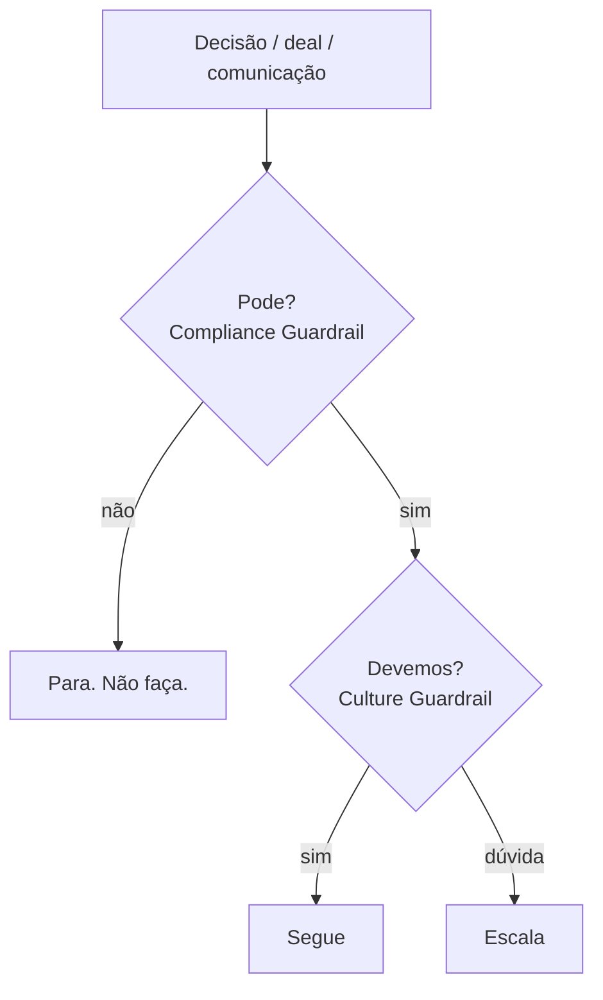

<Info>
  **Ao terminar esta página, você consegue:** aplicar os dois guardrails a uma decisão e saber qual deles está sendo tocado.
</Info>

## O que esta regra protege

A casa nos dois eixos: o legal e o reputacional. Muita coisa é permitida e ainda assim errada para a Bloxs — e o guardrail de cultura existe para essas.

## Os dois guardrails

- **Compliance Guardrail — "pode ou não pode?"** A fronteira legal/regulatória. Ver [Perímetro Regulatório](/regras/perimetro-regulatorio).
- **Culture Guardrail — "mesmo podendo, devemos?"** A fronteira dos princípios. Ver [Reputação acima do Deal](/quem-somos/reputacao-acima-do-deal).

## O que pode

<Check>
  Avançar quando a decisão passa nos dois guardrails
</Check>

## O que não pode

## Quando escalar

Qualquer "não" no compliance, ou qualquer "dúvida" na cultura.

## Quem aprova

Compliance para o primeiro guardrail; liderança/comitê para o segundo, quando há peso reputacional.

## O que registrar

A decisão e qual guardrail foi determinante.

## Exemplos seguros

Recusar um deal lucrativo por razão reputacional, com registro.

## Exemplos proibidos

Aprovar algo "porque não é ilegal" sem olhar a reputação.

## Para onde ir agora

<CardGroup cols={2}>
  <Card title="Perímetro Regulatório" icon="scale-balanced" href="/regras/perimetro-regulatorio">
  </Card>

  <Card title="Red Flags — Quando Parar" icon="triangle-exclamation" href="/regras/red-flags">
  </Card>

  <Card title="Checklist de Conduta" icon="list-check" href="/regras/checklist-conduta">
  </Card>

  <Card title="Reputação acima do Deal" icon="shield-check" href="/quem-somos/reputacao-acima-do-deal">
  </Card>
</CardGroup>