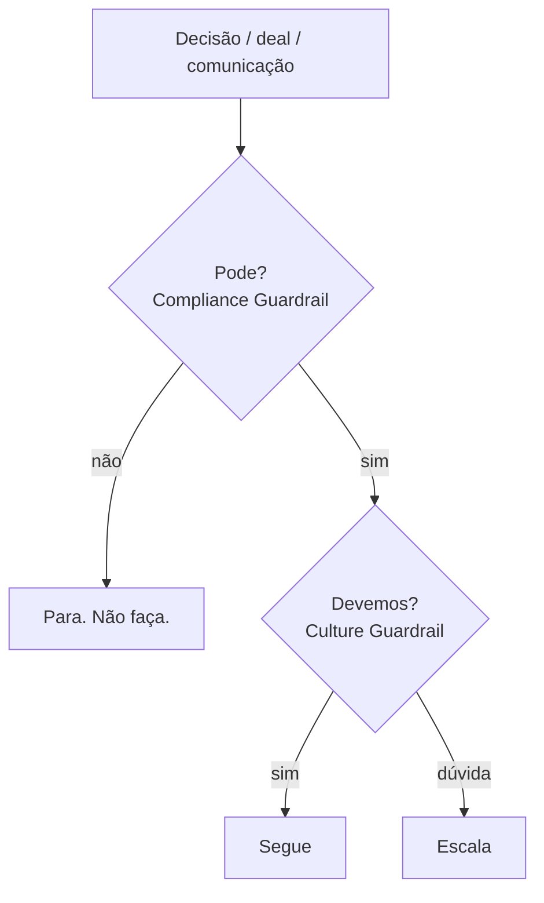

<Info>
  **Ao terminar esta página, você consegue:** reconhecer quando uma decisão precisa parar e subir, e saber qual dos dois guardrails aplicar.
</Info>

## O que é isso

As regras da casa são o que protege a Bloxs quando a planilha diz "sim" mas a casa deveria dizer "não". São dois filtros, e eles não se substituem.

## Os dois guardrails

- **Compliance Guardrail — "pode ou não pode?"** É a fronteira legal e regulatória. Ver o [Perímetro](/produtos/perimetro/originacao-vs-atividade-regulada).
- **Culture Guardrail — "mesmo podendo, devemos?"** É a fronteira dos princípios. Muita coisa é legal e ainda assim errada para a Bloxs.

## Como fazer quando um sinal acende

<Steps>
  <Step title="Pare">
    Não improvise resposta a tomador ou investidor. Parar é a conduta correta, não fraqueza.
  </Step>
  <Step title="Classifique">
    Aprovado · atenção · escalar liderança · escalar comitê · rejeitar por desalinhamento. Na dúvida entre duas, escolha a mais conservadora.
  </Step>
  <Step title="Escale e registre">
    Toda classificação diferente de "aprovado" é registrada. Quem escala protege a casa.
  </Step>
</Steps>

## Os inegociáveis

<Warning>
  - **Reputação acima do deal.** Deal bom no número e ruim na reputação cai — sem exceção.
  - **Lei acima da meta.** O perímetro nunca cede à pressão comercial.
  - Nunca prometer rentabilidade ou liquidez.
  - Material para investidor só pela entidade autorizada, com aprovação.
</Warning>

## Para onde ir agora

<CardGroup cols={2}>
  <Card title="O Perímetro" icon="scale-balanced" href="/produtos/perimetro/originacao-vs-atividade-regulada">
  </Card>

  <Card title="Conduta por Perfil" icon="users" href="/produtos/perimetro/conduta-por-perfil">
  </Card>

  <Card title="Reputação acima do Deal" icon="shield-check" href="/quem-somos/reputacao-acima-do-deal">
  </Card>

  <Card title="Guardrails (detalhe)" icon="filter" href="/regras/guardrails">
  </Card>
</CardGroup>